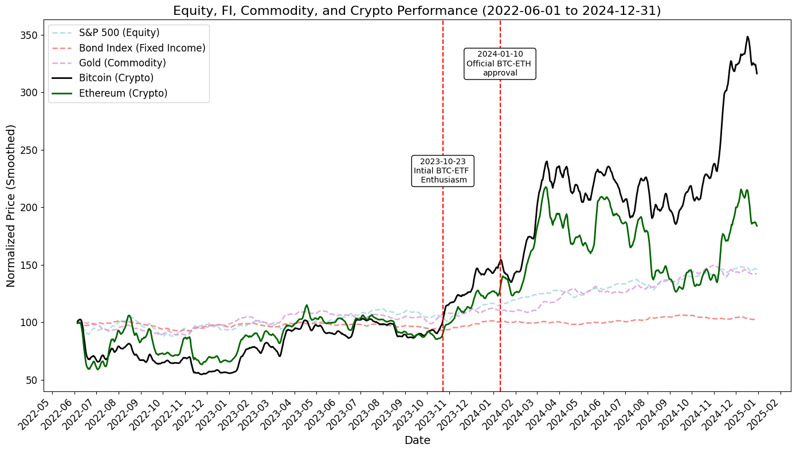
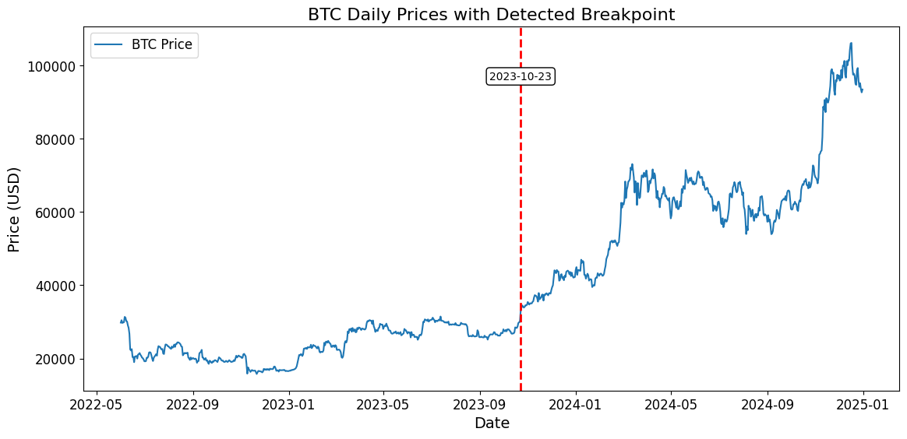
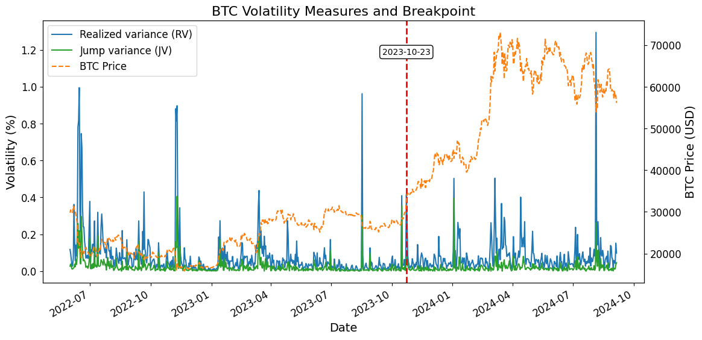
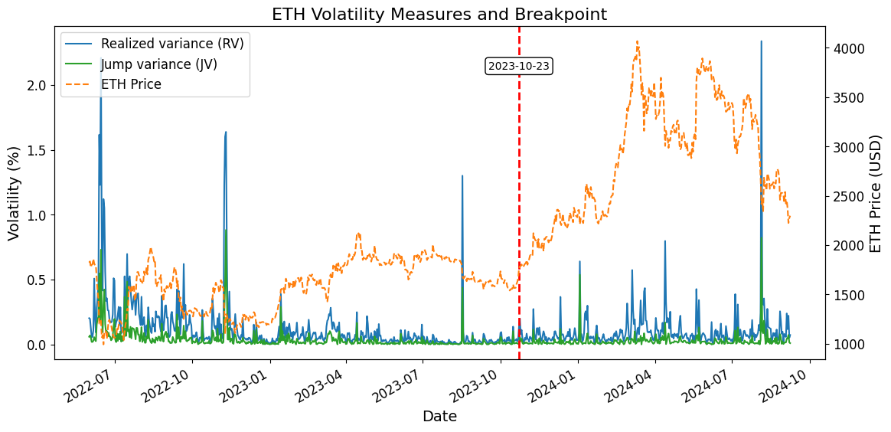
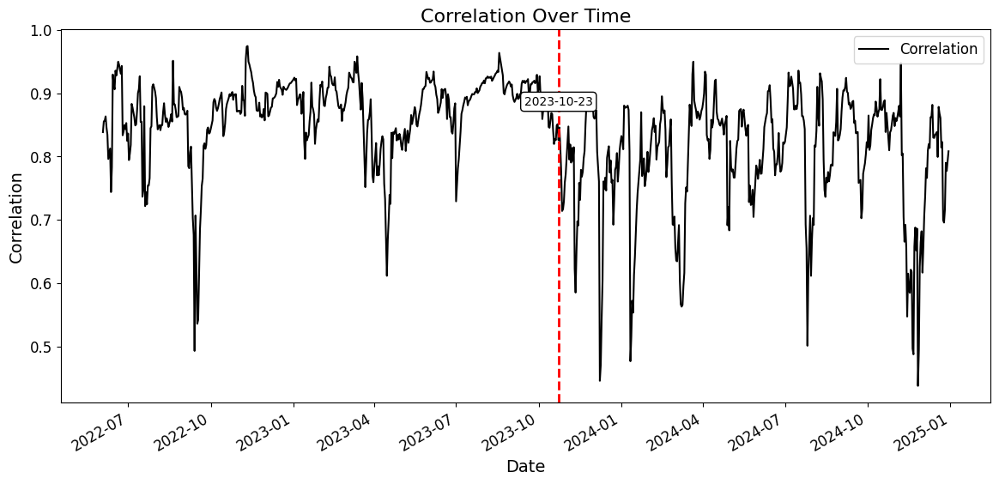

# Volatility Dynamics and Spillovers in Cryptocurrency Markets: Evidence from the Bitcoin ETF Approval

Jingrui Li, Divykumar Patel, and Apoo Koticha

April 16, 2026

## Abstract

This paper investigates the volatility spillover effect following the Bitcoin ETF approval shock. We analyze data from June 2022 to December 2024, identifying October 23, 2023, as a structural break corresponding to this shock. Using high-frequency 5-minute interval data, we decompose Bitcoin and Ethereum’s realized volatility into continuous and jump components via threshold bi-power variation and observe a significant decline in jump volatility for both cryptocurrencies post-shock. Employing a VAR-X model augmented with market indicators, followed by a bivariate GARCH-BEKK analysis, we find that short-term cross-market volatility spillovers between Bitcoin and Ethereum markedly weaken after the breakpoint on October 23, 2023, indicating reduced immediate shock responsiveness. Conversely, long-term volatility interdependence strengthens, reflecting persistent linkages. Moreover, our conditional correlation analysis reveals that while pre-break correlations were robust (consistently above 0.8), post-break correlations weaken considerably—occasionally falling below 0.5—thereby unveiling a distinct shift in co-movements among cryptocurrencies.

*Keywords: Bitcoin ETF, Volatility Spillover, GARCH-BEKK, Volatility Jumps, Cryptocurrency.*

*JEL Classification: G10, C58.*

Jingrui Li (Corresponding Author) is an assistant professor at Stevens Institute of Technology. Email Address: [jli264@stevens.edu](mailto:jli264@stevens.edu). Mailing Address: 1 Castle Point Terrace, Hoboken, NJ 07030. Divykumar Patel is a graduate student at Stevens Institute of Technology. Email Address: [dpatel103@stevens.edu](mailto:dpatel103@stevens.edu). Mailing Address: 1 Castle Point Terrace, Hoboken, NJ 07030. Apoo Koticha is an Associate Teaching Professor at D’Amore-McKim School of Business, Northeastern University. Email Address: [a.koticha@northeastern.edu](mailto:a.koticha@northeastern.edu). Mailing Address: 419 Hayden Hall, Northeastern University, 360 Huntington Avenue, Boston, Massachusetts 02115.

## 1. Introduction

Cryptocurrency markets have witnessed unprecedented growth and volatility in recent years, drawing extensive attention from investors, regulators, and academics alike. Rapid developments driven by both technological advancements and regulatory shifts have significantly reshaped global financial paradigms. Among these transformative events, the approval of a Bitcoin Exchange-Traded Fund (ETF) stands out as particularly impactful. Such regulatory milestones signal increased institutional acceptance and participation, profoundly affecting the risk-return dynamics of digital asset markets.

Bitcoin and Ethereum, the two largest cryptocurrencies by market capitalization, serve as critical indicators within the broader cryptocurrency ecosystem. Their intertwined volatility and return dynamics provide an informative framework for assessing the impact of significant regulatory events. Understanding their volatility co-movements is crucial for effective risk management practices and strategic investment decisions.

Previous research extensively documents evolving conditional correlations and volatility co-movements among cryptocurrencies. Corbet, Lucey, and Yarovaya (2019) demonstrate that correlations between major digital assets are dynamic and highly sensitive to external shocks, significantly impacting investment strategies and diversification opportunities. Further recent work by Kolokolov (2023) provides new insights into the temporal dynamics of volatility spillovers and correlation structures, enriching our understanding of cryptocurrency market interactions.

This paper extends existing literature through a rigorous empirical investigation focused on the volatility effects associated with Bitcoin ETF approval shocks. We initially employ a rank-based Binary Segmentation method, using high-frequency 5-minute interval data, to accurately detect structural breaks and subsequently decompose the realized volatility of Bitcoin and Ethereum into continuous and jump components. This approach adheres closely to established methodologies developed by Andersen and Bollerslev (1998) and Barndorff-Nielsen and Shephard (2004).

Our empirical analysis identifies October 23, 2023, as a significant structural breakpoint, aligning closely with pivotal regulatory developments regarding Bitcoin ETFs. The rank-based Binary Segmentation methodology proves particularly effective due to its robustness in handling non-Gaussian distributions and frequent extreme price movements characteristic of cryptocurrency markets. Clearly delineating this market shift enables a deeper exploration of subsequent volatility dynamics.

High-frequency volatility decomposition reveals a notable decline in jump volatility for Bitcoin and Ethereum post-break, suggesting enhanced market maturity and liquidity. The reduction in abrupt price movements implies decreased susceptibility to transient shocks as the market adapts to the new regulatory landscape.

Beyond marking a calendar event, the October 23, 2023 breakpoint corresponds to a true regulatory watershed: the approval of a spot Bitcoin ETF not only opened the door for pension funds, endowments, and other institutional investors to participate via a familiar, regulated wrapper, but also imposed daily NAV reporting and heightened surveillance. This shift improved liquidity provision—compressing bid–ask spreads and curbing abrupt jumps through enhanced arbitrage between ETF shares and spot holdings—while funneling informed trading into a transparent venue that reduced informational opacity and weakened short-term volatility spillovers between Bitcoin and Ethereum as each asset began to reflect its own fundamentals rather than cross-market contagion. At the same time, these changes carry clear implications for portfolio construction: investors gain a more stable window for adding crypto exposure without suffering extreme price shocks, even as they must remain aware that, over longer horizons, BTC and ETH coalesce into a tighter risk factor.

Expanding on these findings, we employ a VAR-X model enriched with exogenous market indicators, followed by a bivariate GARCH-BEKK framework inspired by Engle and Kroner (1995) and Bollerslev and Wooldridge (1992), to capture dynamic volatility spillovers. The analysis uncovers significant self-volatility effects, alongside meaningful cross-asset volatility spillovers, emphasizing pronounced negative adjustments following the structural break. Complementary conditional correlation analyses further confirm significant shifts; correlations, consistently exceeding 0.8 pre-break, become considerably more volatile post-break, occasionally dropping below 0.5. This weakening correlation indicates fundamental changes in volatility transmission mechanisms.

Complementary conditional correlation analysis underscores a marked shift in BTC-ETH correlation dynamics. Pre-break correlations consistently exceeded 0.8, whereas post-break correlations display considerable volatility, occasionally dropping below 0.5. This weakening in correlation highlights fundamental changes in volatility transmission mechanisms, revealing new arbitrage opportunities and implications for portfolio diversification.

Beyond statistical significance, the GARCH‐BEKK results carry clear economic lessons. By showing that short‐run spillovers between Bitcoin and Ethereum weaken sharply after the ETF approval while long‐run linkages intensify, we highlight how regulatory validation alters the transmission of shocks in practice. In the pre-ETF era, a sudden price movement in one token would almost instantaneously roil the other, amplifying portfolio drawdowns and fueling arbitrage races; post-break, that immediate contagion recedes, allowing traders and market‐makers to isolate idiosyncratic risks and design more effective intraday hedges. Yet over weeks and months, the growing persistence of cross‐asset volatility underscores a new, deeper integration—one that benefits institutions seeking to deploy variance‐swap strategies or set margin requirements, but also raises concerns for systemic risk if a large shock in Bitcoin eventually propagates inexorably into Ethereum. In this way, our GARCH‐BEKK findings speak directly to practitioners on how to adapt risk models, to exchanges on how to calibrate collateral schedules, and to regulators on the evolving interconnectedness of regulated and under-regulated crypto markets.

This paper contributes to the literature in three important ways. First, we introduce a rank-based Binary Segmentation approach to detect a structural break in cryptocurrency markets following the Bitcoin ETF approval shock. By precisely identifying October 23, 2023, as the breakpoint, our method effectively accommodates the non-Gaussian distribution and extreme values characteristic of cryptocurrency data. This robust framework for detecting regime changes represents a significant advancement in understanding how regulatory shocks reshape market dynamics.

Second, our research integrates high-frequency volatility decomposition techniques using threshold bi-power variation (TBPV) to separate the realized volatility of Bitcoin and Ethereum into continuous and jump components. Our analysis reveals a pronounced decline in jump volatility after the structural break, suggesting that the regulatory shock has contributed to a more mature market environment with fewer extreme price movements.

Third, we model the dynamic interdependencies and volatility spillovers between Bitcoin and Ethereum using a VAR-X model enhanced with exogenous market indicators, complemented by a bivariate GARCH-BEKK framework. Our results demonstrate robust self-volatility effects and significant cross-asset spillovers that exhibit notable changes around the structural break on October 23, 2023. Specifically, short-term cross-market volatility spillovers, captured by the parameters a12* = -0.259 and a21* = -0.196 (both statistically significant at the 1% level), significantly weakened after the breakpoint, indicating reduced immediate responsiveness between the cryptocurrencies following regulatory developments. Conversely, long-term spillover effects, represented by the parameters g12* = 0.038 and g21* = 0.054, intensified post-break, suggesting an increased and persistent volatility linkage. Additionally, conditional correlation analysis reveals robust pre-break correlations consistently above 0.8, which subsequently weaken considerably, occasionally falling below 0.5. These results highlight a structural shift towards a more integrated yet distinctively responsive cryptocurrency market in response to the introduction of Bitcoin ETF.

The remainder of the paper is structured as follows. Section 2 reviews related literature, establishing the context and theoretical foundation for our study. Section 3 outlines the history of Bitcoin ETF approvals and provides a detailed description of the data employed. Section 4 conducts a structural break analysis centered around the Bitcoin ETF approval shock, identifying and validating critical market regime shifts. Section 5 examines the realized volatility decomposition of Bitcoin and Ethereum returns, comparing volatility dynamics before and after the identified breakpoint of October 23, 2023. Section 6 further investigates the volatility dynamics and spillover effects between Bitcoin and Ethereum using advanced econometric modeling. Section 7 provides a robustness analysis by examining the impact of the identified structural break on the conditional correlation between Bitcoin and Ethereum. Finally, Section 8 summarizes the key findings, discusses implications, and concludes the paper.

## 2. Related Literature

The literature examining volatility spillovers, structural breaks, and dynamic correlations within cryptocurrency markets has expanded rapidly, driven by growing academic interest and market significance. Early foundational works by Andersen and Bollerslev (1998) and Barndorff-Nielsen and Shephard (2004) introduce advanced methodologies for measuring realized volatility and separating continuous from jump volatility components. These methodologies have since become foundational for subsequent cryptocurrency volatility studies.

Bollerslev and Wooldridge (1992) provide crucial methodological advancements through quasi-maximum likelihood estimation techniques, essential for modeling dynamic volatility and conditional covariances in financial data, particularly under conditions of non-normality and heteroskedasticity. Engle and Kroner (1995) further refine volatility modeling by introducing the bivariate GARCH-BEKK framework, widely adopted for capturing complex interdependencies and volatility spillovers among multiple financial assets.

Empirical studies specifically exploring volatility spillovers within cryptocurrency markets are extensive. Palamalai and Maity (2019) investigate return and volatility spillovers across eight major cryptocurrencies using a BEKK-GARCH model, highlighting pronounced volatility co-movements yet varying spillover intensities. Similarly, Katsiampa, Corbet, and Lucey (2019) utilize both Diagonal and Asymmetric BEKK models to demonstrate robust volatility interdependencies among cryptocurrencies, particularly emphasizing high levels of persistence in volatility.

Katsiampa, Corbet, and Lucey (2019) further confirm strong positive volatility co-movements between Bitcoin and Ethereum through a bivariate Diagonal BEKK model, providing critical insights for investment management. Additionally, Kumar and Anandarao (2019) reinforce these findings using multiresolution wavelet and BEKK approaches, demonstrating significant volatility interconnections among major cryptocurrencies.

Recent contributions from Huynh, Nasir, and Nguyen (2020) and Shahzad, Bouri, Kang, and Saeed (2021) incorporate VAR-SVAR methodologies and Student’s-t Copulas to capture asymmetric spillover risks, with Huynh, Nasir, and Nguyen (2020) noting the distinct role of smaller cryptocurrencies as significant volatility transmitters. Bouri, Gabauer, Gupta, and Tiwari (2021) further advance the analysis by investigating how investor sentiment, particularly negative sentiment, influences volatility connectedness, underlining that investor psychology significantly drives market volatility linkages.[^1]

Several foundational studies have emphasized Bitcoin’s role as a dominant cryptocurrency. Yi, Xu, and Wang (2018) and Omane-Adjepong and Alagidede (2019) show how Bitcoin exerts considerable volatility spillover effects on smaller cryptocurrencies, confirming Bitcoin’s dominant position within the market hierarchy. Further supporting this, recent evidence by John, Li, and Liu (2024a) highlights significant arbitrage spreads across global cryptocurrency exchanges, particularly for Bitcoin, illustrating the cryptocurrency’s centrality and its broader influence on market pricing dynamics. John and Li (2025) decompose Bitcoin’s realized volatility into continuous and jump components and show that spikes in Robinhood retail trading predict increases in ten‐day continuous volatility, while shocks to anonymous Monero trading volume forecast higher five‐day jump volatility. Together, these findings imply that retail participation drives persistent price variability, whereas anonymity‐motivated trades fuel abrupt price jumps in Bitcoin.

The impact of ETFs on financial markets has been extensively documented. Ben-David, Franzoni, and Moussawi (2018) show that greater ETF ownership of a stock leads to higher non-fundamental volatility and stronger negative return autocorrelation—and that this induced volatility risk carries a significant undiversifiable premium, with stocks exhibiting high ETF ownership earning up to 56 basis points per month. Krause, Ehsani, and Lien (2014) show that as ETF trading has surged, volatility spillovers from ETFs to their largest component stocks become economically significant—and grow larger with higher liquidity, greater fund ownership shares, NAV deviations, ETF flows, and overall ETF market capitalization, with the strongest effects observed in smaller-cap stocks.

The impact of external shocks such as regulatory decisions and macroeconomic news on cryptocurrency markets has been extensively explored. Andersen and Bollerslev (1998), Barndorff-Nielsen and Shephard (2004), and Corsi, Pirino, and Reno (2010) advance methodologies to distinguish between continuous volatility and jump components, providing nuanced insights into market reactions to sudden external events. Caporale (2021) specifically investigate the effect of cyber-attacks on volatility spillovers among major cryptocurrencies, finding that these events intensify spillovers and reduce diversification benefits. John, Kurov, and Li (2024) show that attention to the Russia-Ukraine war negatively affects Bitcoin returns and increases its volatility, while attention to SWIFT sanctions against Russia positively influences Bitcoin prices and decreases jump volatility, reinforcing Bitcoin’s role as an alternative to traditional financial systems.

Regulatory shocks, particularly the introduction and approval of Bitcoin ETFs, have recently attracted substantial attention. Bhaskar (2015), Wu (2024), Espel (2024), and Chen (2025) document various aspects surrounding Bitcoin ETF introductions, from premium-discount behaviors to intraday regime changes, demonstrating how regulatory shifts significantly influence cryptocurrency volatility and market behavior. Building on the established literature, recent empirical work by Kolokolov (2023) introduces fresh perspectives on temporal volatility spillover dynamics and correlation structures, further enriching our understanding of cryptocurrency market mechanisms.

By synthesizing and extending these methodologies and insights, our paper rigorously investigates the volatility spillover effects surrounding the Bitcoin ETF approval shock, contributing novel empirical evidence and advanced econometric modeling techniques to capture structural changes, volatility decomposition, and cross-market interdependencies.

## 3. Bitcoin ETF Approval History and Data Description

### 3.1 Bitcoin ETF Approval History

Since Bitcoin’s inception in 2009, efforts to introduce a spot Bitcoin ETF have faced significant regulatory challenges. The first notable attempt occurred in 2013 when Cameron and Tyler Winklevoss submitted their application to the U.S. Securities and Exchange Commission (SEC). Despite multiple resubmissions, their proposals were consistently rejected due to concerns regarding market manipulation and inadequate oversight of cryptocurrency exchanges. In 2020, Grayscale Investments made strides by converting its Bitcoin Investment Trust into an SEC-reporting entity, becoming the first publicly traded Bitcoin fund in the U.S., although not technically an ETF.

A significant milestone occurred in 2021 when the SEC approved the ProShares Bitcoin Futures ETF listed on the Chicago Mercantile Exchange (CME), signaling increased regulatory acceptance. In 2022, however, the SEC continued to deny spot Bitcoin ETF applications, including one from Grayscale Investments, which subsequently initiated legal action against the Commission. In August 2023, the U.S. Court of Appeals ruled in favor of Grayscale, criticizing the SEC’s prior rejections as insufficiently justified. This landmark ruling triggered a shift in the SEC’s stance, culminating in the approval of 11 spot Bitcoin ETF applications—including those from major institutions such as BlackRock, ARK, Fidelity, and Grayscale—in January 2024. SEC Chair Gary Gensler formally announced these approvals on January 10, 2024.

### [Insert Figure 1 Here]

Figure 1 illustrates the normalized and smoothed price trajectories of key asset classes—including cryptocurrencies (Bitcoin and Ethereum), equities (S&P 500), fixed income (Bond Index), and commodities (Gold)—over the period from June 1, 2022, to December 31, 2024. The prices are normalized to a baseline of 100 at the start of the observation window, facilitating a clear comparison of relative performance across asset classes. Two significant regulatory dates are marked: the initial enthusiasm around Bitcoin ETF approval on October 23, 2023, and the official SEC approval of the Bitcoin spot ETF on January 10, 2024. Prior to October 23, 2023, Bitcoin and Ethereum prices tracked closely, exhibiting relatively modest fluctuations aligned with broader market trends. However, following the break point corresponding to heightened Bitcoin ETF enthusiasm, both cryptocurrencies experienced notable appreciation, diverging significantly from traditional financial instruments such as equities, bonds, and commodities, which showed stable, moderate growth throughout this period. This divergence intensified after the official approval on January 10, 2024, with Bitcoin prices surging sharply, followed by Ethereum, highlighting increased volatility and distinctively altered market dynamics in response to this transformative regulatory milestone. This visual comparison effectively underscores the pronounced and asymmetric impact of regulatory milestones on cryptocurrency markets relative to traditional asset classes.

### 3.2 Data Description

Our analysis utilizes daily price data for Bitcoin and Ethereum, obtained through the “yfinance” library.[^2] The data spans from June 1, 2022, to December 31, 2024, a period specifically chosen to capture a comprehensive overview of cryptocurrency price dynamics, particularly emphasizing market reactions around recent regulatory developments, such as Bitcoin ETF approval. This timeframe is strategically selected to provide sufficient observations to identify meaningful trends and effectively detect structural breaks. By maintaining a consistent dataset across our structural break tests and subsequent VAR-X and GARCH-BEKK estimations, we ensure methodological coherence and robustness in our empirical results.

## 4. Structural Break Analysis of the Bitcoin ETF Approval Shock

### 4.1 Structural Break Test

On June 29, 2022, the U.S. Securities and Exchange Commission (SEC) officially rejected Grayscale’s proposal to convert its Grayscale Bitcoin Trust (GBTC) into a spot Bitcoin ETF. Immediately following this decision, Grayscale responded by filing a lawsuit and a petition for review with the U.S. Court of Appeals for the District of Columbia Circuit. This marked the beginning of what became known as the “Bitcoin ETF saga,” a critical regulatory episode influencing global perceptions and interest in digital asset investments.

Given the various events leading to the final official Bitcoin ETF approval, we conduct structural break test to detect important turning points in Bitcoin price trends. To detect structural breaks in Bitcoin price dynamics, we employed a Binary Segmentation (Binseg) method with a rank-based model from the ruptures package. Specifically, the rank-based cost function is defined as follows:

`cyu:v=rankyu:v-Erankyu:v` (1)

where yu:v represents the data segment between points u and v, rank∙ denotes the rank transformation of observations, and E∙ indicates the expected value. This cost function measures deviations of observed ranks from their expected ranks, making it robust against the non-Gaussian distributions and extreme values frequently observed in cryptocurrency returns.[^3]

Rank-based methods were specifically chosen for analyzing cryptocurrency markets for three primary reasons. First, cryptocurrency returns exhibit greater extremes compared to conventional financial markets, rendering traditional statistical methods less effective. Second, the pronounced volatility fluctuations and unpredictable shifts typical of cryptocurrency data necessitate methods that accommodate varying market conditions. Third, the rank-based transformation allows us to equitably handle both minor and significant price changes, resulting in a balanced and comprehensive evaluation of market behavior.

In analyzing daily Bitcoin price data from June 1, 2022, to December 31, 2024, our structural break analysis identifies October 23, 2023, as a significant turning point, coinciding with heightened market enthusiasm regarding the potential approval of a spot Bitcoin ETF.

### [Insert Figure 2 Here]

Figure 2 presents the daily price trajectory of Bitcoin from June 1, 2022, through December 31, 2024. A vertical dashed red line marks October 23, 2023, indicating a significant structural breakpoint identified using a rank-based Binary Segmentation method. Before the breakpoint, Bitcoin prices show moderate fluctuations and relative stability, whereas post-break prices demonstrate pronounced upward momentum and increased volatility. This clear visual shift underscores the market’s strong reaction to ETF-related regulatory developments, particularly highlighting the importance of the structural breakpoint as a turning point in Bitcoin market dynamics.

### 4.2 Economic News and Structural Breakpoint Context

Two significant economic news events coincided with the identified structural breakpoint on October 23, 2023, reinforcing its importance in our analysis.

The first event involved a widely circulated tweet highlighting that BlackRock’s iShares Bitcoin Trust (IBTC) had been listed on the Depository Trust & Clearing Corporation (DTCC).[^4] Although IBTC was officially listed since August 2023, this tweet reignited investor enthusiasm and speculative interest, fueling market anticipation regarding imminent spot Bitcoin ETF approvals. The rapid dissemination of this news notably intensified investor activity and contributed to substantial volatility during this period.

### [Insert Figure 3 Here]

Figure 3 displays the tweet by Eric Balchunas on October 23, 2023, emphasizing the IBTC’s DTCC listing. Despite the listing being publicly available since August, this announcement sparked renewed market speculation and expectations for imminent regulatory approval. The timing of this news closely aligns with our empirically identified structural breakpoint, demonstrating the significant influence of regulatory developments on cryptocurrency market sentiment.

The second event on the same date was the official closure of the legal dispute between Grayscale Investments and the SEC by the U.S. Court of Appeals for the District of Columbia Circuit.[^5] This concluded the legal proceedings initiated after the SEC’s previous rejection of Grayscale’s application to convert its Bitcoin Trust into a spot ETF. The court previously ruled on August 29, 2023, declaring the SEC’s decision “arbitrary and capricious,” thereby compelling the agency to revisit its prior rejection. The official closure of this case on October 23, 2023, marked a critical turning point and advanced market anticipation of eventual Bitcoin ETF approval.

Together, these concurrent events—the DTCC listing tweet and the formal conclusion of Grayscale’s lawsuit—underscore October 23, 2023, as a pivotal date in the cryptocurrency market. To empirically validate and quantify the significance of this breakpoint, we conducted a detailed structural break analysis, systematically comparing market behavior before and after this critical event.

### 4.3 Summary Statistics for BTC and ETH Before and After October 23, 2023

This section provides summary statistics for Bitcoin and Ethereum returns, comparing periods before and after the structural breakpoint identified on October 23, 2023. Table 1 presents key statistical measures including central tendency (mean and median returns), variability (standard deviation), distribution shape (skewness and kurtosis), quartile measures (Q1, Q3, and interquartile range—IQR), and t-test results comparing means between periods.

### [Insert Table 1 Here]

Table 1 summarizes daily return statistics for Bitcoin and Ethereum from June 1, 2022, to December 31, 2024, divided into two periods according to the structural breakpoint identified on October 23, 2023. The results show notable differences in return characteristics before and after the breakpoint. For Bitcoin, the mean daily return increased from 0.03% pre-break to 0.30% post-break, suggesting improved market sentiment and greater price momentum following ETF-related regulatory news. Ethereum experienced a similar, though slightly smaller, improvement, with mean returns rising from -0.03% to 0.21%. Median returns also shifted positively for both cryptocurrencies, reinforcing the evidence of generally stronger market performance in the post-break period.

Variability, as measured by standard deviation, remained relatively stable for Bitcoin (from 2.71% to 2.75%), but decreased slightly for Ethereum (from 3.68% to 3.32%), indicating somewhat moderated volatility post-break for Ethereum. Moreover, the shift in skewness from negative to positive for both Bitcoin (-0.369 to 0.519) and Ethereum (-0.095 to 0.782) implies an increased likelihood of large positive returns after the breakpoint. Kurtosis decreased for both cryptocurrencies, particularly for Bitcoin (from 6.276 to 2.118), indicating a reduction in extreme return events and a more normalized return distribution post-break.

Overall, these summary statistics indicate that the market behavior of both Bitcoin and Ethereum significantly changed after the structural breakpoint associated with regulatory developments on October 23, 2023.

## 5. Realized Volatility Decomposition of BTC and ETH Before and After October 23, 2023

This section provides an in-depth analysis of cryptocurrency market volatility using high-frequency trading (HFT) data at 5-minute intervals. To clearly identify the impact of the structural breakpoint (October 23, 2023), we divide the dataset into two distinct periods: the pre-break period (before October 23, 2023) and the post-break period (after October 23, 2023). Three essential volatility metrics are employed: Realized Volatility (RV), Continuous Variation (CV), and Jump Variation (JV). This division facilitates a systematic examination of volatility dynamics around the breakpoint, revealing how market microstructure evolved in response to significant regulatory developments.

To estimate realized volatility for Bitcoin and Ethereum, we follow the approach established in the literature, notably by Andersen and Bollerslev (1998) and Andersen et al. (2001). Andersen and Bollerslev demonstrated that realized volatility, computed as the summation of squared high-frequency intraday returns, converges to the quadratic variation of the price process as the sampling frequency increases. While Bollerslev, Tauchen, and Zhou (2009) estimate realized volatility for equities using 78 five-minute increments corresponding to standard equity market hours (9:30 am-4:00 pm), we modify this method for cryptocurrencies, which trade continuously 24 hours a day, resulting in 288 five-minute increments per day.[^6] Specifically, the realized volatility (RVt) on day t is calculated as follows:

`RVt=j=1nrj2 p QVt-1,t, for n → ∞,` (2)

where rj denotes the log return (log⁡(SjSj-1)) for each 5-minute interval within day t, and n is the total number of intervals per day (288 in the case of cryptocurrency markets).[^7]

To distinguish between continuous volatility and abrupt price movements (jumps), we employ the Threshold Bipower Variation (TBPV) method developed by Corsi, Pirino, and Reno (2010). The TBPV estimator combines the bipower variation with threshold estimation, providing more accurate detection of jump volatility compared to traditional bipower variation methods (Barndorff-Nielsen and Shephard, 2004, 2006). Formally, the TBPV estimator on day t is defined as:

`TBPVt=μ1-2j=2nrj-1∙rjI{rj-12≤vj-1}I{rj2≤vj}` (3)

where vj is a strictly positive random threshold function, vj:[t-1,t]⟶R+, μ1≃0.7979, and I{∙} is the indicator function. Using this approach, we separate the realized volatility into continuous (CV) and jump (JV) components, with the continuous variation computed using the TBPV estimator.

Table 2 summarizes the results of our volatility decomposition analysis for Bitcoin and Ethereum.

### [Insert Table 2 Here]

Table 2 reports the decomposition of daily volatility for Bitcoin and Ethereum into three components: Realized Volatility (RV), Continuous Variation (CV), and Jump Variation (JV), using high-frequency data. The analysis compares volatility before and after the structural breakpoint of October 23, 2023.

For Bitcoin, Realized Volatility (RV) remains relatively stable, decreasing slightly from a mean of 0.079 pre-break to 0.078 post-break, but the change is statistically insignificant (p-value = 0.856). Continuous Variation (CV) shows a slight increase post-break (from 0.055 to 0.059), although this change is also not statistically significant (p-value = 0.53). However, Jump Variation (JV) experiences a significant decline, decreasing from 0.024 to 0.019 post-break, with statistical significance at the 5% level (p-value = 0.049). This reduction indicates that abrupt, extreme price movements became less frequent or smaller in magnitude after the structural break, signaling increased market stability or maturity.

Similarly, for Ethereum, Realized Volatility (RV) decreases from 0.129 pre-break to 0.105 post-break, significant at the 10% level (p-value = 0.073). Continuous Variation (CV) declines modestly from 0.087 to 0.077, though the decrease is not statistically significant (p-value = 0.248). Most notably, Ethereum’s Jump Variation (JV) shows a substantial and statistically significant decline from 0.042 to 0.028 (p-value = 0.007, significant at the 1% level). This indicates a pronounced reduction in sudden price jumps post-break, consistent with improved market conditions, such as greater liquidity or reduced speculative activity.

Overall, the statistically significant declines in Jump Variation for both cryptocurrencies confirm the structural breakpoint’s economic importance, marking a shift towards fewer extreme price shocks and reflecting enhanced market stability post-break.

### [Insert Figure 4 Here]

Figure 4 presents the decomposition of daily realized volatility (RV) and jump volatility (JV) for Bitcoin and Ethereum based on high-frequency trading (HFT) data from July 2022 to October 2024. Volatility is measured through standard realized variance methods (RV) for overall volatility and Threshold Bipower Variation (TBPV) for isolating jump volatility. The structural breakpoint of October 23, 2023, identified through previous analysis, is indicated by the vertical red dashed line to clearly differentiate volatility behavior before and after this regulatory event.

In Panel A, which displays volatility components for Bitcoin, there is a noticeable prevalence of volatility spikes and frequent jump events preceding the breakpoint. Following the structural break, jump volatility significantly declines, indicating fewer extreme or sudden price movements. This reduction in jump volatility coincides with a period of substantial price appreciation, suggesting that regulatory developments around the breakpoint contributed positively to market maturity, liquidity, and stability.

In Panel B, Ethereum exhibits a similar volatility pattern. Prior to October 23, 2023, volatility and jump events are frequent and pronounced. However, post-break, Ethereum’s jump volatility markedly decreases, mirroring Bitcoin’s shift toward more stable volatility patterns. Additionally, overall volatility appears to moderate after the breakpoint. These findings further highlight the role regulatory milestones played in enhancing market stability and reducing abrupt volatility movements in Ethereum trading.

Together, these observations from Panels A and B underscore October 23, 2023, as a crucial regulatory turning point with significant implications for volatility dynamics and market maturity within cryptocurrency markets.

## 6. Volatility Dynamics and Spillovers between Bitcoin and Ethereum

### 6.1 VAR-X Framework for BTC and ETH Returns

The Vector Autoregressive (VAR) model is a foundational econometric approach used extensively in quantitative finance to model the dynamic interrelationships among multiple time series. This model is particularly suited to capturing the dynamics of financial returns, which inherently exhibit stochastic behavior and complex interactions, including sudden and significant price movements. However, financial return series typically display heteroskedasticity, a condition where error term variance varies over time, making the VAR model insufficient on its own for comprehensive analysis.

To address these limitations, we extend our VAR analysis by integrating Generalized Autoregressive Conditional Heteroskedasticity (GARCH) models, specifically the BEKK (Engle and Kroner (1995)) formulation. GARCH models are particularly advantageous because they adeptly handle volatility clustering—a scenario commonly observed in financial markets where high-volatility events tend to follow one another, as do periods of low volatility. This feature enables us to model and predict market volatility with greater accuracy.

We construct a VAR-X(1) model comprising two endogenous variables (BTC and ETH returns) and two exogenous variables (a structural break dummy, Dₜ, and the market volatility index, VIXt). The model is formally represented as:

`Yt =C+AYt-1+BXt +ϵt` (4)

`BTCtETHt= CBTCCETH+α11α12α21α22BTCt-1ETHt-1+β11β12β21β22DtVIX_LAGt+ϵ1,tϵ2,t` (5)

The explicit VAR-X equations are:

`BTCt=CBTC+α11BTCt-1+α12ETHt-1+β11Dt+β12VIXt-1+ϵ1,t` (6)

`ETHt=CETH+α21BTCt-1+α22ETHt-1+β21Dt+β22VIXt-1+ϵ2,t` (7)

We also provide the detailed variable and parameter description in our estimation as in the following table:

| Category | Symbol | Definition/Description |
| --- | --- | --- |
| Endogenous Variables (Y₍ₜ₎) | BTC(t) | The return of Bitcoin (BTC) at time t |
|  | ETH(t) | The return of Ethereum (ETH) at time t |
| Exogenous Variables (X₍ₜ₎) | D(t) | A dummy variable indicating the presence of a structural break at time t = 10/23/2023 (coded as 0 before the break and 1 after) |
|  | VIX(t) | VIX index at time t, representing market volatility |
| System Parameters |  |  |
| Intercepts (C) | C(btc) | Intercept term for the BTC equation, representing the base return of BTC when all lagged terms and exogenous variables are zero |
|  | C(eth) | Intercept term for the ETH equation, representing the base return of ETH when all lagged terms and exogenous variables are zero |
| Autoregressive Coefficients (α) | α11 | Coefficient capturing the effect of BTC’s own lagged return on its current return |
|  | α12 | Coefficient capturing the effect of ETH's lagged return on BTC’s current return |
|  | α21 | Coefficient capturing the effect of BTC’s lagged return on ETH’s current return |
|  | α22 | Coefficient capturing the effect of ETH’s own lagged return on its current return |
| Exogenous Coefficients (β) | β11 | Coefficient capturing the effect of the dummy variable on BTC’s current return |
|  | β12 | Coefficient capturing the effect of the lagged VIX index on BTC’s current return |
|  | β21 | Coefficient capturing the effect of the dummy variable on ETH’s current return |
|  | β22 | Coefficient capturing the effect of the lagged VIX index on ETH’s current return |

### [Insert Table 3 Here]

Table 3 presents the estimation results of a Vector Autoregression (VAR) model capturing the dynamic interrelationships between Bitcoin (BTC) and Ethereum (ETH) returns. The model is estimated using Ordinary Least Squares (OLS), with robust HC3 standard errors to address potential heteroskedasticity in the residuals. The parameters C(btc) and C(eth) denote the intercept terms for the respective Bitcoin and Ethereum return equations, while coefficients αij measure the autoregressive dynamics, indicating how past returns influence current returns within and between the cryptocurrencies. The exogenous variable coefficients β11, β12, β21, β22 represent the impacts of the structural break dummy and the lagged VIX index on the cryptocurrency returns. Statistical significance at the 10%, 5%, and 1% levels is indicated by *, **, and ***, respectively.

The results indicate statistically significant intercept terms for both BTC (C(btc)=0.011, p =0.018) and ETH (C(eth)=0.015, p value=0.007), suggesting a meaningful baseline return distinct from zero. In contrast, the autoregressive parameters (αij) suggest limited immediate spillovers between Bitcoin and Ethereum returns, indicating weak cross-market predictive power in the short-run. Notably, the coefficients related to the exogenous variables reveal that Bitcoin returns significantly respond to the lagged VIX index (β12=-0.001, p value=0.014), signifying that Bitcoin performance is sensitive to broader market volatility conditions. Similarly, Ethereum exhibits sensitivity to the lagged VIX index (β22=-0.001, p value=0.004), suggesting a significant external influence of market uncertainty on Ethereum returns as well.

To further validate the robustness and reliability of our VAR-X model estimation, we present diagnostic test results for the residuals in Table 4.

### [Insert Table 4 Here]

Table 4 summarizes the diagnostic test results performed on residuals from the Vector Autoregression (VAR) model applied to Bitcoin (BTC) and Ethereum (ETH) returns. Four key diagnostic tests are conducted: (1) the Augmented Dickey-Fuller (ADF) test assesses stationarity, testing the null hypothesis that residuals have a unit root (indicating non-stationarity); (2) the Ljung–Box test (with 10 lags) checks for autocorrelation, with the null hypothesis stating no autocorrelation in residuals up to lag 10; (3) the Jarque-Bera test evaluates normality of residuals, with the null hypothesis asserting normally distributed residuals; and (4) the ARCH LM test examines heteroskedasticity, testing the null hypothesis of no ARCH effects.

The test results reported in Table 4 demonstrate strong stationarity for both BTC and ETH residuals, as indicated by highly significant Augmented Dickey-Fuller (ADF) test statistics (BTC: -30.623, ETH: -30.593, both p value < 0.001). The Ljung–Box test statistics reveal no significant autocorrelation in the residuals for either BTC or ETH, confirming appropriate model specification in terms of temporal dependence. However, significant Jarque-Bera test outcomes (p value < 0.001 for both cryptocurrencies) indicate substantial deviations from normality, suggesting the presence of extreme values or potential outliers typical in cryptocurrency returns. The ARCH LM test strongly rejects the null hypothesis of no ARCH effects (BTC: 47.800, ETH: 70.036, both p value < 0.001), clearly demonstrating residual volatility clustering and validating the subsequent application of a GARCH-based approach for modeling volatility dynamics.

Consequently, while Table 3 demonstrates the suitability of the VAR-X model for capturing baseline return dynamics, Table 4 reveals residual volatility patterns that necessitate further modeling through a GARCH-based approach, specifically addressed in the subsequent GARCH-BEKK analysis.

### 6.2 Modeling Volatility Spillovers: GARCH-BEKK Approach

The VAR-X model effectively identified significant baseline returns for Bitcoin and Ethereum while highlighting the impact of external market volatility factors. Despite its utility, the VAR framework is limited in its capacity to fully capture complex volatility dynamics, notably volatility clustering, prevalent in financial markets. To address these complexities, we employ a specialized GARCH-BEKK model, renowned for its robustness in forecasting conditional variances and capturing volatility interactions across financial assets.

Consider the mean‐adjusted return vector rt=(r1t, r2t)' representing residual returns for Bitcoin and Ethereum after subtracting their respective conditional means (from a VAR‐X model). The BEKK (1,1) model, which accommodates structural breaks via a dummy variable Dt, is defined by the following recursive equation:

`Ht=C'Cconstant+At'rt-1rt-1'AtARCH+Gt'Ht-1GtGARCH` (8)

The matrices are defined conditionally based on the structural break:

- No-break period (Dt=0): At=A, Gt=G

- Break period (Dt=1): At=A+A*, Gt=G+G*

where:

`C= c110c21c22, A= a11a12a21a22, G= g11g12g21g22,`

`A*= 0a12*a21*0, G*= 0g12*g21*0, Ht= h11,th12,th12,th22,t` (9)

The model components are interpreted as follows:

- Conditional Covariance Matrix Ht: Captures dynamic volatility and covariance structures.

- Constant Component C'C: Represents the stable baseline covariance structure, ensuring positive definiteness.

- ARCH Component (Short-run Shock Effects) At'rt-1rt-1'At: Reflects immediate impacts of past shocks on current volatility.

- GARCH Component (Long-run Persistence Effects) Gt'Ht-1Gt: Indicates how past volatility persists into future periods.

Structural break parameters (A* and G*) specifically capture changes in cross-asset volatility spillovers during structural shifts, affecting the off-diagonal elements associated with spillovers between Bitcoin and Ethereum.

We also provide the detailed variable and parameter description in our estimation as in the following table:

| Category | Symbol | Definition/Description |
| --- | --- | --- |
| Constant Matrix (C) | c11 | Base level of Bitcoin’s conditional variance |
|  | c12 | Base level of BTC-ETH covariance |
|  | c22 | Base level of Ethereum’s conditional variance |
| ARCH Matrix (A) (Short-run Shock Effects) | a11 | Impact of Bitcoin’s own past shocks on its volatility |
|  | a12 | Impact of Ethereum’s shocks on Bitcoin’s volatility |
|  | a21 | Impact of Bitcoin’s shocks on Ethereum’s volatility |
|  | a22 | Impact of Ethereum’s own past shocks on its volatility |
| GARCH Matrix (G) (Long-run Persistence Effects) | g11 | Long-term persistence in Bitcoin’s volatility |
|  | g12 | Long-term impact of Ethereum’s volatility on Bitcoin |
|  | g21 | Long-term impact of Bitcoin’s volatility on Ethereum |
|  | g22 | Long-term persistence in Ethereum’s volatility |
| Structural Break Parameters | a12* | Change in Ethereum’s shock impact on Bitcoin after break |
|  | a21* | Change in Bitcoin’s shock impact on Ethereum after break |
|  | g12* | Change in Ethereum’s volatility spillover to Bitcoin after break |
|  | g21* | Change in Bitcoin’s volatility spillover to Ethereum after break |

To enhance our analysis of volatility and spillovers between Bitcoin and Ethereum, we employ a multivariate GARCH-BEKK model. The GARCH-BEKK model is estimated using the Quasi-Maximum Likelihood Estimation (QMLE) approach, widely recognized in volatility modeling (Bollerslev and Wooldridge, 1992). The log-likelihood function under conditional normality assumptions is:

`lθ=-12t=1TlndetHt+ϵt⊤Ht-1ϵt` (10)

Here, Ht​ represents the conditional covariance matrix at time t, and ϵt is the vector of residuals. In practice, the negative log-likelihood function is minimized to yield parameter estimates that best capture observed volatility dynamics. This BEKK formulation, introduced by Baba et al. (1990) and Engle and Kroner (1995), adeptly handles dynamic volatilities and their interdependencies.

Due to common heteroscedasticity and deviations from normality in financial series, we employ robust standard errors via a sandwich estimator to ensure reliable inference. Following Bollerslev and Wooldridge (1992), the robust covariance matrix is computed as:

`VCOVθ=H-1BH-1` (11)

where H is the Hessian matrix of the log-likelihood function, and B is the outer product of the score vectors, which measure the sensitivity of the likelihood function with respect to the parameters. This approach, as detailed by White (1980​) and refined in the context of volatility models by Bollerslev and Wooldridge (1992​), produces standard errors robust to heteroscedasticity and model misspecification.

In estimating the BEKK model, we employ the L-BFGS-B optimization algorithm, selecting parameter bounds and initial values via a preliminary grid search to improve convergence and numerical stability. Positive definiteness of the conditional covariance matrices (Ht) is maintained through eigenvalue adjustments and stability constraints, as recommended by Engle and Kroner (1995).

We next report our GARCH-BEKK estimation results in the following Table 5.

### [Insert Table 5 Here]

The GARCH-BEKK model estimates presented in Table 5 provide critical insights into the volatility interdependencies and spillover effects between Bitcoin and Ethereum, utilizing Quasi-Maximum Likelihood Estimation (QMLE) to ensure robustness. Notably, the constants associated with conditional variances (c11, c21, and c22) are statistically significant. Specifically, the coefficient c11 is near zero, indicating minimal intrinsic volatility persistence within Bitcoin. In contrast, the significant coefficients c21 and c22, with values of 0.009 and 0.005 respectively, highlight substantial baseline covariance between Bitcoin and Ethereum, as well as inherent volatility within Ethereum.

The ARCH components, representing the immediate impact of past shocks, indicate that Bitcoin’s volatility is substantially influenced by its own past shocks (a11 = 0.339). Similarly, Ethereum’s volatility also strongly responds to its historical shocks (a22 = 0.346). These results emphasize pronounced self-reactivity in volatility within each cryptocurrency. However, the cross-asset ARCH effects (a12 and a21) are relatively weak, suggesting limited direct short-run volatility spillovers between Bitcoin and Ethereum. Importantly, the structural break adjustments (a12* = -0.259 and a21* = -0.196, significant at the 1% level) indicate substantial negative shifts in how shocks from one cryptocurrency influence the other’s volatility during periods of market stress.

Importantly, long-run volatility persistence, measured through the GARCH terms, remains high for Bitcoin (g11 = 0.843) and Ethereum (g22 = 0.896), implying enduring volatility patterns. The structural break further intensifies volatility spillovers, as seen in the significant coefficients g12* (0.038) and g21* (0.054), suggesting increased long-term interconnectedness between the volatility dynamics of Bitcoin and Ethereum after structural changes. Collectively, these findings underline the pronounced influence of structural break (on October 23, 2023) on volatility spillovers, indicating that regulatory or market-driven events substantially reshape the risk dynamics between these cryptocurrencies.

The results from the GARCH-BEKK estimation highlight significant changes in volatility spillovers between Bitcoin and Ethereum before and after the structural breakpoint on October 23, 2023. Specifically, the parameters a12* = -0.259 and a21* = -0.196, both statistically significant at the 1% level, reveal that the short-term cross-market volatility impacts between these cryptocurrencies became notably weaker following this breakpoint. This indicates a marked reduction in immediate volatility spillover effects, suggesting that Bitcoin and Ethereum became temporarily less reactive to each other’s shocks after the identified regulatory event. In contrast, the positive and significant long-term parameters g12* = 0.038 and g21* = 0.054 imply an increased and persistent volatility linkage in the post-break period. Overall, these findings suggest that while immediate cross-market sensitivity declined, the longer-term volatility interdependence intensified, reflecting a structural shift towards a more integrated yet differently responsive cryptocurrency market following the pivotal regulatory developments on October 23, 2023.

### 6.3 Model Diagnostics Validation

In this section, we conducted rigorous diagnostic tests on the residuals of the GARCH-BEKK model for Bitcoin (BTC) and Ethereum (ETH) to confirm the robustness of our volatility modeling and ensure the residual series are free from common econometric issues, including non-stationarity, autocorrelation, and heteroskedasticity.

We report our diagnostic test results in the following Table 6.

### [Insert Table 6 Here]

Table 6 summarizes the results from these diagnostic evaluations. The Augmented Dickey-Fuller (ADF) tests yielded highly significant results, with test statistics of -28.356 for BTC and -31.140 for ETH (both with p-values of 0.000). These results strongly reject the null hypothesis of non-stationarity, confirming that residual series from the GARCH-BEKK model are stationary and thus reliable for further inference and forecasting.

Additionally, the Ljung–Box tests with 10 lags indicated no significant autocorrelation in squared residuals, returning p-values of 0.422 for BTC and 0.954 for ETH. These findings demonstrate that the model effectively accounts for the conditional volatility structure, leaving no significant unmodeled autocorrelation.

Moreover, the ARCH LM tests for conditional heteroskedasticity produced p-values of 0.992 for BTC and 1.000 for ETH, decisively indicating no remaining ARCH effects in the residuals. This outcome suggests that the GARCH-BEKK model adequately captures volatility clustering phenomena inherent in cryptocurrency return dynamics.

Collectively, these diagnostic results validate the appropriateness and effectiveness of our GARCH-BEKK model, confirming its ability to robustly capture and explain the complex volatility patterns observed in the Bitcoin and Ethereum markets.

## 7. Robustness Analysis: Impact of Structural Break (October 23, 2023) on BTC-ETH Conditional Correlation

This section conducts a robustness test of the previously identified structural breakpoint on October 23, 2023, focusing specifically on the dynamic conditional correlation between Bitcoin (BTC) and Ethereum (ETH). By employing the GARCH-BEKK model, we further validate the structural break’s significance and investigate its impact on the evolving correlation dynamics of these cryptocurrencies. Understanding shifts in asset correlations is particularly important for portfolio management and risk mitigation strategies.

### [Insert Figure 5 Here]

Figure 5 illustrates the dynamic conditional correlation estimates derived from the model, emphasizing how the structural break has influenced BTC-ETH correlation patterns. Although the long-run correlation between Bitcoin and Ethereum remains relatively stable, the short-run conditional correlation experiences greater volatility and more frequent divergences post-break. Prior to October 23, 2023, the correlations were consistently strong, frequently exceeding 0.8. However, the post-break period exhibits increased instability, with correlation occasionally declining below 0.5, reflecting periods of weakened interdependence.

These results reinforce the validity of the previously conducted structural break analysis, clearly demonstrating a significant shift in market behavior around October 23, 2023, likely driven by regulatory developments or changes in investor sentiment. The observed changes in conditional correlations substantiate the robustness of the identified breakpoint, underscoring its practical importance for market participants. Consequently, investors and portfolio managers face critical new considerations regarding portfolio diversification and risk management strategies in response to these altered market dynamics.

## 8. Conclusion

This paper examines the impact of the Bitcoin ETF approval shock on cryptocurrency markets, providing a comprehensive analysis of structural breaks, volatility decomposition, and volatility spillovers between Bitcoin and Ethereum. Our study demonstrates that significant regulatory events can fundamentally alter market dynamics, and we show that advanced econometric techniques paired with high-frequency data analysis reveal these shifts in real time. We emphasize that understanding these transformations is critical for investors, policymakers, and market practitioners who navigate the volatile landscape of digital assets, and our findings contribute to a deeper and more nuanced understanding of the forces at work in these markets.

Our structural break analysis identifies October 23, 2023, as a pivotal turning point in market behavior following the Bitcoin ETF approval shock. This breakpoint clearly marks a regime shift in the data, and we illustrate that the use of a rank-based Binary Segmentation approach effectively detects this change despite the challenges posed by non-Gaussian distributions and extreme values. The identification of such a structural break underscores the sensitivity of cryptocurrency markets to regulatory events, and it sets the stage for our further exploration into how volatility patterns evolve in response to external shocks.

We decompose the realized volatility of Bitcoin and Ethereum using high-frequency 5-minute interval data and threshold bi-power variation, separating it into continuous and jump components. Our analysis reveals a pronounced decline in jump volatility in the post-break period, suggesting that the regulatory shock fosters a market environment with fewer abrupt price movements and more stability. This shift in volatility dynamics indicates that the market may be maturing, as the frequency and magnitude of extreme price jumps diminish, thereby enhancing overall market liquidity and offering a more predictable risk profile for market participants.

We examine dynamic interdependencies and volatility spillovers between Bitcoin and Ethereum by employing a VAR-X model enhanced with exogenous market indicators, complemented by a bivariate GARCH-BEKK framework and dynamic conditional correlation analysis. Our findings reveal robust self-volatility effects and substantial cross-asset spillovers, which notably shift following a structural break identified on October 23, 2023. Specifically, short-term cross-market volatility spillovers significantly diminish after the breakpoint, indicating reduced immediate responsiveness between these cryptocurrencies in response to regulatory developments. Conversely, long-term volatility spillover effects strengthen post-break, suggesting a heightened and persistent volatility linkage. Additionally, conditional correlation analysis indicates strong pre-break correlations consistently exceeding 0.8, which subsequently weaken markedly, occasionally declining below 0.5.

In summary, our study highlights that the Bitcoin ETF approval shock exerts profound and lasting effects on cryptocurrency market volatility dynamics. Integrating structural break detection, high-frequency volatility decomposition, and sophisticated volatility spillover modeling not only advances our understanding of market behavior but also provides practical insights for adapting investment strategies following regulatory shifts. These findings emphasize the importance of continually refining analytical tools to monitor evolving market interdependencies and underscore the need for further exploration into regulatory impacts within increasingly complex digital financial markets.

## Reference

Andersen, T.G. and Bollerslev, T., 1998. Deutsche mark–dollar volatility: intraday activity patterns, macroeconomic announcements, and longer run dependencies. the Journal of Finance, 53(1), pp.219-265.

Barndorff-Nielsen, O.E. and Shephard, N., 2004. Power and bipower variation with stochastic volatility and jumps. Journal of financial econometrics, 2(1), pp.1-37.

Ben‐David, I., Franzoni, F. and Moussawi, R., 2018. Do ETFs increase volatility?. The Journal of Finance, 73(6), pp.2471-2535.

Bhaskar, N.D., Nian, L.P. and Chuen, D.L.K., 2015. Bitcoin IPO, ETF, and crowdfunding. In Handbook of Digital Currency(pp. 529-557). Academic Press.

Bollerslev, T., 1986. Generalized autoregressive conditional heteroskedasticity. Journal of econometrics, 31(3), pp.307-327.

Bollerslev, T. and Wooldridge, J.M., 1992. Quasi-maximum likelihood estimation and inference in dynamic models with time-varying covariances. Econometric reviews, 11(2), pp.143-172.

Bouri, E., Gabauer, D., Gupta, R. and Tiwari, A.K., 2021. Volatility connectedness of major cryptocurrencies: The role of investor happiness. Journal of Behavioral and Experimental Finance, 30, p.100463.

Caporale, G.M., Kang, W.Y., Spagnolo, F. and Spagnolo, N., 2021. Cyber-attacks, spillovers and contagion in the cryptocurrency markets. Journal of International Financial Markets, Institutions and Money, 74, p.101298.

Corbet, S., Lucey, B., Urquhart, A. and Yarovaya, L., 2019. Cryptocurrencies as a financial asset: A systematic analysis. International Review of Financial Analysis, 62, pp.182-199.

Corsi, F., Pirino, D. and Reno, R., 2010. Threshold bipower variation and the impact of jumps on volatility forecasting. Journal of Econometrics, 159(2), pp.276-288.

Chen, Y.L., Xu, K. and Yang, J.J., 2025. Market impact of the bitcoin ETF introduction on bitcoin futures. International Review of Financial Analysis, 97, p.103810.

Engle, R.F. and Kroner, K.F., 1995. Multivariate simultaneous generalized ARCH. Econometric Theory, 11(1), pp.122-150.

Espel, T.J., 2024, November. Impact of US Bitcoin ETF Introduction on BTC and ETH Intraday Regime Seasonality. In Proceedings of the Future Technologies Conference (pp. 30-46). Cham: Springer Nature Switzerland.

Huynh, T.L.D., Nasir, M.A., Vo, X.V. and Nguyen, T.T., 2020. “Small things matter most”: The spillover effects in the cryptocurrency market and gold as a silver bullet. The North American Journal of Economics and Finance, 54, p.101277.

John, K., Kurov, A. and Li, J., 2024. Russia-Ukraine War and Bitcoin Volatility Dynamics. NYU Stern School of Business Research Paper (forthcoming).

John, K. and Li, J., 2025. Bitcoin price volatility: Effects of retail traders, illegal users, and sentiment. Journal of Corporate Finance, p.102837.

John, K., Li, J. and Liu, R., 2024a. Pricing and Arbitrage Across 80 Cryptocurrency Exchanges. Available at SSRN 4816710.

John, K., Li, J. and Liu, R., 2024b. Sentiment in the Cross Section of Cryptocurrency Returns. Available at SSRN 4941032.

Katsiampa, P., 2019. Volatility co-movement between Bitcoin and Ether. Finance Research Letters, 30, pp.221-227.

Katsiampa, P., Corbet, S. and Lucey, B., 2019. High frequency volatility co-movements in cryptocurrency markets. Journal of International Financial Markets, Institutions and Money, 62, pp.35-52.

Katsiampa, P., Corbet, S. and Lucey, B., 2019. Volatility spillover effects in leading cryptocurrencies: A BEKK-MGARCH analysis. Finance Research Letters, 29, pp.68-74.

Kim, B.H., Kim, H. and Lee, B.S., 2015. Spillover effects of the US financial crisis on financial markets in emerging Asian countries. International Review of Economics & Finance, 39, pp.192-210.

Kolokolov, A., 2023. Cryptocrashes. Available at SSRN 4663313.

Krause, T., Ehsani, S. and Lien, D., 2014. Exchange-traded funds, liquidity and volatility. Applied Financial Economics, 24(24), pp.1617-1630.

Kumar, A.S. and Anandarao, S., 2019. Volatility spillover in crypto-currency markets: Some Evidences from GARCH and wavelet analysis. Physica A: statistical mechanics and its applications, 524, pp.448-458.

Luu Duc Huynh, T., 2019. Spillover risks on cryptocurrency markets: A look from VAR-SVAR granger causality and student’s t copulas. Journal of Risk and Financial Management, 12(2), p.52.

Mazur, M. and Polyzos, E., 2024. Spot Bitcoin ETF. Available at SSRN 4810965.

Omane-Adjepong, M. and Alagidede, I.P., 2019. Multiresolution analysis and spillovers of major cryptocurrency markets. Research in International Business and Finance, 49, pp.191-206.

Palamalai, S. and Maity, B., 2019. Return and volatility spillover effects in leading cryptocurrencies. Global Economy Journal, 19(03), p.1950017.

Shahzad, S.J.H., Bouri, E., Kang, S.H. and Saeed, T., 2021. Regime specific spillover across cryptocurrencies and the role of COVID-19. Financial Innovation, 7, pp.1-24.

White, H., 1980. A heteroskedasticity-consistent covariance matrix estimator and a direct test for heteroskedasticity. Econometrica: Journal of the Econometric Society, pp.817-838.

Wu, D., 2024. Bitcoin ETF: Opportunities and risk. arXiv preprint arXiv:2409.00270.

Yi, S., Xu, Z. and Wang, G.J., 2018. Volatility connectedness in the cryptocurrency market: Is Bitcoin a dominant cryptocurrency?. International Review of Financial Analysis, 60, pp.98-114.

**Figure 1. Normalized Price Comparison of Key Asset Classes**

Figure 1 illustrates the normalized and smoothed price trajectories of key asset classes—including cryptocurrencies (Bitcoin and Ethereum), equities (S&P 500), fixed income (Bond Index), and commodities (Gold)—over the period from June 1, 2022, to December 31, 2024. All prices have been normalized to 100 at the start of the observation window to facilitate direct comparison. The vertical dashed lines mark two crucial events: October 23, 2023, corresponding to heightened market enthusiasm surrounding the anticipated Bitcoin ETF approval, and January 10, 2024, marking the official SEC approval of the Bitcoin spot ETF.

**Figure 2. Structural Break Point Detection**

Figure 2 illustrates Bitcoin’s daily price trajectory from June 2022 to December 2024. The vertical red dashed line marks a significant structural breakpoint identified on October 23, 2023, using a rank-based binary segmentation approach.

**Figure 3. Tweet which Sparked BTC ETF Enthusiasm on 10/23/2023**

Figure 3 shows a widely circulated tweet by Eric Balchunas on October 23, 2023, which announced the listing of BlackRock’s iShares Bitcoin Trust (IBTC) on the Depository Trust & Clearing Corporation (DTCC).

**Table 1. Summary Statistics of Bitcoin, Ethereum**

Table 1 summarizes daily return statistics for Bitcoin and Ethereum from June 1, 2022, to December 31, 2024. The dataset is divided into two segments based on the structural breakpoint identified on October 23, 2023. The table highlights distinct changes in return characteristics, particularly increases in mean returns for both cryptocurrencies after the breakpoint. Additionally, changes in skewness and kurtosis indicate notable shifts in return distributions, suggesting altered market dynamics and potentially different risk profiles in the post-break period.

|  | Bitcoin | Ethereum |  |  |
| --- | --- | --- | --- | --- |
|  | Before | After | Before | After |
| Mean Return (%) | 0.03% | 0.30% | -0.03% | 0.21% |
| Median Return (%) | -0.11% | 0.15% | -0.12% | 0.15% |
| Std Dev (%) | 2.71% | 2.75% | 3.68% | 3.32% |
| Skewness | -0.369 | 0.519 | -0.095 | 0.782 |
| Kurtosis | 6.276 | 2.118 | 5.07 | 4.158 |
| Q1 (%) | -1.02% | -1.12% | -1.44% | -1.44% |
| Q3 (%) | 1.11% | 1.56% | 1.37% | 1.78% |
| IQR (%) | 2.13% | 2.67% | 2.81% | 3.21% |
| Mean T-test Statistic | 1.533 | 1.075 |  |  |
| Mean T-test p-value | 0.126 | 0.283 |  |  |

**Table 2. Daily Volatility Components Using High-Frequency Data**

Table 2 presents the decomposition of daily volatility components for Bitcoin and Ethereum using high-frequency trading (HFT) data. The analysis divides the dataset into pre- and post-break periods based on the structural breakpoint of October 23, 2023, and compares three essential volatility metrics: Realized Volatility (RV), Continuous Variation (CV), and Jump Variation (JV). Realized Volatility (RV) captures overall daily volatility, while Continuous Variation (CV) and Jump Variation (JV) distinguish between persistent volatility and abrupt price movements, respectively. The table reports mean values for each component, differences between periods, and associated statistical significance tests. Asterisks indicate statistical significance at the *10%, **5%, and ***1% confidence levels.

|  | Bitcoin |  | Ethereum |  |  |  |  |
| --- | --- | --- | --- | --- | --- | --- | --- |
|  | RV | CV | JV |  | RV | CV | JV |
| Pre-Break Mean | 0.079 | 0.055 | 0.024 |  | 0.129 | 0.087 | 0.042 |
| Post-Break Mean | 0.078 | 0.059 | 0.019 |  | 0.105 | 0.077 | 0.028 |
| Difference | -0.001 | 0.004 | -0.005 |  | -0.024 | -0.01 | -0.013 |
| T-statistic | -0.182 | 0.627 | -1.969 |  | -1.794 | -1.156 | -2.686 |
| P-value | 0.856 | 0.53 | 0.049** |  | 0.073* | 0.248 | 0.007*** |

**Figure 4. Daily Realized and Jump Volatility Components for Bitcoin and Ethereum**

Figure 4 illustrates the decomposition of daily volatility components for Bitcoin and Ethereum using high-frequency trading (HFT) data spanning from July 2022 to October 2024. The figure presents the Realized Volatility (RV) estimated through standard methods and separates abrupt price changes (Jump Variation, JV) from continuous volatility (Continuous Variation, CV) using the Threshold Bipower Variation (TBPV) approach. Volatility measures (RV, CV, and JV) are expressed as percentages on the left axis, while Bitcoin prices in USD are depicted on the right axis for comparison. The vertical red dashed line indicates the structural breakpoint identified on October 23, 2023, clearly illustrating differences in volatility dynamics before and after this regulatory event.

Panel A: Daily Realized and Jump Volatility Components for Bitcoin

Panel B: Daily Realized and Jump Volatility Components for Ethereum

**Table 3. VAR Model Estimates for Bitcoin and Ethereum Returns**

Table 3 presents the estimated parameters from a Vector Autoregression (VAR) model analyzing the dynamic relationship between Bitcoin (BTC) and Ethereum (ETH) returns. The model parameters were estimated using the Ordinary Least Squares (OLS) method, with HC3 robust standard errors to account for potential heteroskedasticity in residuals. Parameters C(btc)and C(eth) denote the constant terms for Bitcoin and Ethereum, respectively. The coefficients αij and βij reflect dynamic cross-asset interactions and responses to exogenous variables within the cryptocurrency pair. Statistical significance is indicated by asterisks at the *10%, **5%, and ***1% significance levels.

| Parameter | Estimate | Std. Error | p-value |
| --- | --- | --- | --- |
| C(btc) | 0.011 | 0.004 | 0.018* |
| C(eth) | 0.015 | 0.006 | 0.007** |
| α11 | -0.01 | 0.06 | 0.862 |
| α12 | -0.024 | 0.047 | 0.96 |
| α21 | -0.066 | 0.076 | 0.382 |
| α22 | 0.011 | 0.06 | 0.849 |
| β11 | 0 | 0.002 | 0.957 |
| β12 | -0.001 | 0 | 0.014* |
| β21 | -0.002 | 0.003 | 0.429 |
| β22 | -0.001 | 0 | 0.004** |

**Table 4. Residual Diagnostic Test Results from VAR Estimation (BTC-ETH)**

Table 4 presents diagnostic test results for the residuals derived from the Vector Autoregression (VAR) model of Bitcoin (BTC) and Ethereum (ETH) returns. Four critical tests are conducted: (1) the Augmented Dickey-Fuller (ADF) test for stationarity (null hypothesis: the residual series contains a unit root, indicating non-stationarity), (2) the Ljung-Box test with 10 lags for autocorrelation (null hypothesis: no autocorrelation in residuals up to lag 10), (3) the Jarque-Bera test for normality (null hypothesis: residuals follow a normal distribution), and (4) the ARCH LM test for conditional heteroskedasticity (null hypothesis: no ARCH effects present in residuals). Corresponding p-values are reported in parentheses below each test statistic, indicating the statistical significance of the respective diagnostic tests.

| Test | BTC_Error | ETH_Error |
| --- | --- | --- |
| ADF Test | -30.623 | -30.593 |
|  | (0.000) | (0.000) |
| Ljung–Box Test (lag 10) |  |  |
|  | 9.349 | 10.917 |
|  | (0.499) | (0.364) |
| Jarque–Bera Test | 864.531 | 1011.557 |
|  | (0.000) | (0.000) |
| ARCH LM Test | 47.800 | 70.036 |
|  | (0.000) | (0.000) |

**Table 5. GARCH-BEKK Model Estimates for Bitcoin-Ethereum Volatility**

Table 5 reports parameter estimates from the GARCH-BEKK model, capturing volatility dynamics and spillover effects between Bitcoin (BTC) and Ethereum (ETH). The parameters are estimated using the Quasi-Maximum Likelihood Estimation (QMLE) approach, with robust standard errors. Parameter a₂₁​ represents the immediate impact of Bitcoin shocks on Ethereum volatility, while g₂₁​ captures the long-term impact of Bitcoin volatility on Ethereum. Parameters marked with an asterisk (*) indicate structural break adjustments:
a21* measures the change in the effect of Bitcoin shocks on Ethereum volatility after the structural breakpoint, and
g21* indicates the corresponding change in volatility spillover from Bitcoin to Ethereum post-break. Statistical significance is denoted by asterisks at the *10%, **5%, and ***1% levels.

| Parameter | Estimate |  |  |  |  |
| --- | --- | --- | --- | --- | --- |
| c11 | 0.000*** | (0.001) |  |  |  |
| c21 | 0.009*** | (0.000) |  |  |  |
| c22 | 0.005*** | (0.000) |  |  |  |
| a11 | 0.339*** | (0.000) |  |  |  |
| a12 | -0.006 | (0.878) | a12* | -0.259*** | (0.000) |
| a21 | -0.066 | (0.420) | a21* | -0.196*** | (0.000) |
| a22 | 0.346*** | (0.000) |  |  |  |
| g11 | 0.843*** | (0.000) |  |  |  |
| g12 | 0.031* | (0.083) | g12* | 0.038*** | (0.000) |
| g21 | 0.066 | (0.103) | g21* | 0.054*** | (0.000) |
| g22 | 0.896*** | (0.000) |  |  |  |

**Table 6. Standardized Squared Residual Diagnostic Tests from GARCH-BEKK Model (BTC-ETH)**

Table 6 provides diagnostic test results for the standardized squared residuals obtained from the GARCH-BEKK model estimation for Bitcoin (BTC) and Ethereum (ETH). Three critical diagnostics are reported: (1) the Augmented Dickey-Fuller (ADF) test for stationarity (null hypothesis: residuals contain a unit root, indicating non-stationarity), (2) the Ljung-Box test for autocorrelation at 10 lags (null hypothesis: no autocorrelation in residuals up to lag 10), and (3) the ARCH LM test for conditional heteroskedasticity (null hypothesis: no ARCH effects present in residuals). P-values indicating statistical significance are provided in parentheses below each test statistic.

| Test | BTC | ETH |
| --- | --- | --- |
| ADF Test | -28.356 | -31.140 |
|  | (0.000) | (0.000) |
| Ljung–Box Test (lag 10) |  |  |
|  | 10.207 | 3.834 |
|  | (0.422) | (0.954) |
| ARCH LM Test | 2.421 | 0.731 |
|  | (0.992) | (1.000) |

**Table 7. Robustness Test: Structural Break Comparison Across Alternative ETF Dates**

| Date       | Event                                                            | Delta Jump Volatility                                            | Delta Short-run Spillover                                                        | Delta Long-run Spillover                                                             |
|:-----------|:-----------------------------------------------------------------|:-----------------------------------------------------------------|:---------------------------------------------------------------------------------|:-------------------------------------------------------------------------------------|
| 2023-08-29 | Grayscale court ruling                                           | Strong decrease (BTC Δ=-0.0003, p=0.000; ETH Δ=-0.0007, p=0.000) | Weak short-run spillover decrease (a12*=-0.0977, p=0.266; a21*=-0.3199, p=0.330) | No robust long-run spillover increase (g12*=-0.0795, p=0.597; g21*=-0.4102, p=0.449) |
| 2023-10-23 | ETF enthusiasm / DTCC listing attention / Grayscale case closure | Strong decrease (BTC Δ=-0.0002, p=0.000; ETH Δ=-0.0006, p=0.000) | Weak short-run spillover decrease (a12*=-0.1031, p=0.239; a21*=-0.3400, p=0.295) | No robust long-run spillover increase (g12*=-0.1494, p=0.346; g21*=-0.5782, p=0.291) |
| 2024-01-10 | Official SEC spot Bitcoin ETF approval                           | Strong decrease (BTC Δ=-0.0002, p=0.000; ETH Δ=-0.0006, p=0.000) | Weak short-run spillover decrease (a12*=-0.0962, p=0.262; a21*=-0.3169, p=0.298) | No robust long-run spillover increase (g12*=-0.1539, p=0.336; g21*=-0.4833, p=0.367) |

Note: Jump-volatility deltas are computed from recovered daily RV/CV/JV panels. Spillover deltas are BEKK-style proxy estimates from VAR-X residual shocks and lagged volatility terms; regenerate this table if the full recovered R QMLE BEKK estimator is ported or run in an R environment.

**Figure 5. Daily Conditional correlation from GARCH-BEKK Model**

Figure 5 shows the time-varying conditional correlation between Bitcoin and Ethereum, estimated using the GARCH-BEKK base case model. The structural breakpoint identified on October 23, 2023, is indicated by a vertical dashed red line. The observed correlation dynamics align closely with realized correlations derived from high-frequency trading data, providing empirical validation for the effectiveness and accuracy of the GARCH-BEKK model in capturing evolving interdependencies between these cryptocurrencies.

## Notes

[^1]: A recent study related to market sentiment by John, Li, and Liu (2024b) finds that cryptocurrencies with higher sensitivity to sentiment innovations, captured by their “CryptoSent” index, experience lower subsequent returns, indicating that sentiment is a significant risk factor in cryptocurrency pricing.

[^2]: The details about accessing “yfinance” library through Python can be found at [https://pypi.org/project/yfinance/](https://pypi.org/project/yfinance/).

[^3]: The large jumps observed in cryptocurrency returns—particularly for Bitcoin—are documented in John and Li (2025).

[^4]: [https://www.bitget.com/news/detail/12560603823512](https://www.bitget.com/news/detail/12560603823512).

[^5]: [https://www.coindesk.com/policy/2023/10/23/grayscale-court-victory-over-sec-in-spot-bitcoin-etf-case-made-final](https://www.coindesk.com/policy/2023/10/23/grayscale-court-victory-over-sec-in-spot-bitcoin-etf-case-made-final)

[^6]: Borri and Santucci de Magistris (2022) use a similar estimation methodology to study Bitcoin return jumps in the compensation for skewness and kurtosis in the stochastic discount factor.

[^7]: For any semimartingale X, the quadratic variation process QV0,T=X,X=(X,X)t∈0,T=X2-2X_dX.
